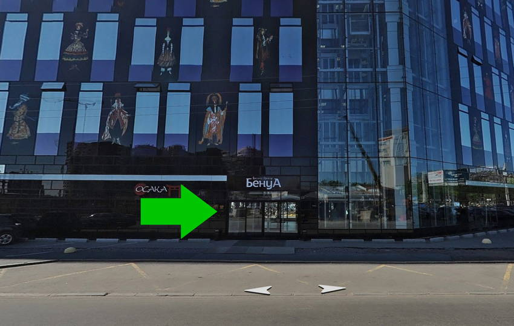

## Расписание

- **18:30** Вход
- **19:00** Открытие
- **19:10** Можно вообще всё. Раскладка по гриду, Вадим Макеев
- **19:40** Перерыв
- **19:50** Новые лампочки в Люстре, Михаил Баранов
- **20:20** Перерыв
- **20:30** Ложь Фотошопа и как с этим жить, Филипп Нуруллин
- **21:00** Закрытие

## Доклады

### Можно вообще всё. Раскладка по гриду

Верстаете как юный бог на флексах или пасёте флоуты по углам — неважно. Когда-нибудь вам придётся перейти на грид-раскладки. Не просто инлайн-блоки на стероидах, как флексы, а принципиально новую систему, созданную специально для сложных раскладок. Понятное введение и примеры использования для реальных задач.

_Вадим Макеев_

### Новые лампочки в Люстре

В начале 2016 года в Adobe Illustrator был полностью обновлён способ работы с SVG. Как сильно это может повлиять на удобство работы верстальщика и что можно было бы ещё улучшить.

_Михаил Баранов_

### Ложь Фотошопа и как с этим жить

Когда и как делать типографику при разработке сайта. Почему типографика для сайта в Фотошопе или любом другом графическом редакторе плохая идея. Typecast — инструмент шрифтовой правды и облегчения коммуникации дизайнера с верстальщиком.

_Филипп Нуруллин_

## Площадка

Бизнес-центр «Бенуа» на Пискарёвском проспекте, 2, к. 2. Офис Яндекса на 5 этаже, на ресепшене вас встретят. Приезжайте заранее, после 19:10 попасть в зал будет проблематично. [Инструкция как добраться](https://yandex.ru/company/contacts/spb/), есть платная парковка.
