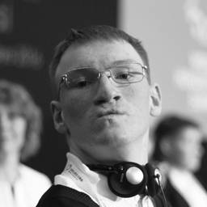
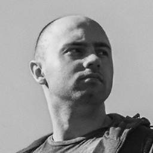
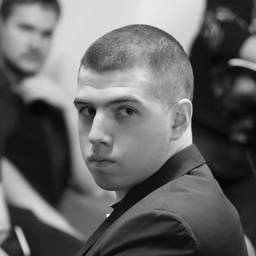
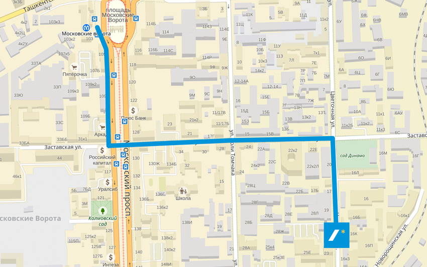
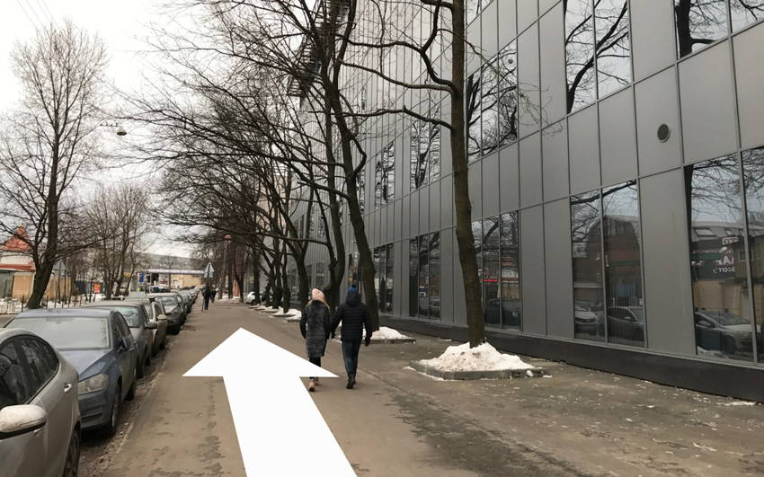
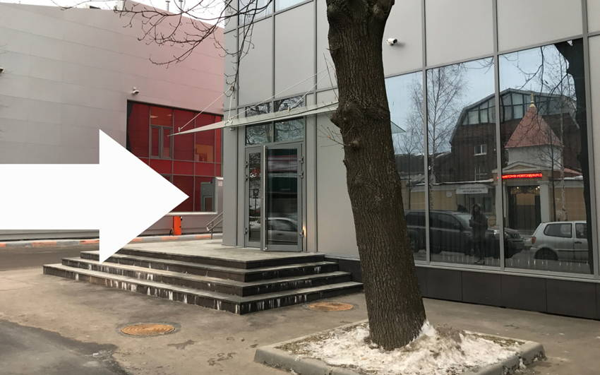
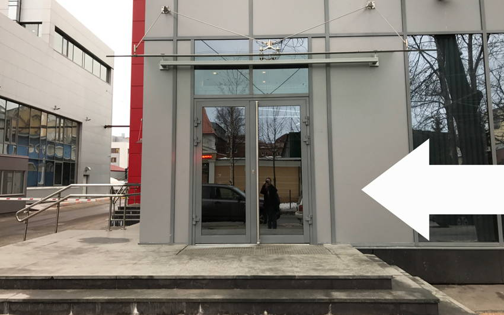

## Расписание

- **18:30** Вход
- **19:00** Открытие
- **19:10** Почему я не могу пользоваться твоим сайтом? Иван Бакаидов
- **19:30** Перерыв
- **19:40** Adaptive or dead, Денис Воронов
- **20:00** Перерыв
- **20:10** Как не писать CSS и радоваться жизни, Алексей Сафин
- **20:30** Закрытие

## Доклады

### Почему я не могу пользоваться твоим сайтом?

Особенности и трудности использования веба для людей с ограниченными возможностями. Поговорим о том, как сайты могут стать удобнее на примерах популярных ресурсов.

_Иван Бакаидов, разработчик ПО для особых людей_

### Adaptive or dead

Как помочь сайту не загнуться на смартфоне, а дизайнеру — на рабочем месте. Рассказ о принципах оценки, подходе к макетированию, про магию Sketch и о том, почему сетка не решает.

_Денис Воронов, дизайнер в [Шишках](http://www.shishki.pro/)_

### Как не писать CSS и радоваться жизни

Что происходит, если в компании клиентскими приложениями занимаются разные люди в разных отделах? Как сделать библиотеку клиентских компонентов, которая позволяет забыть про CSS или как съесть слона по частям.

_Алексей Сафин, фронтенд-разработчик в [Selectel](https://selectel.ru/)_

## Площадка

Встреча пройдёт в офисе компании Selectel на Цветочной, 19. Ближайшие станции метро: Московские ворота, Электросила.

