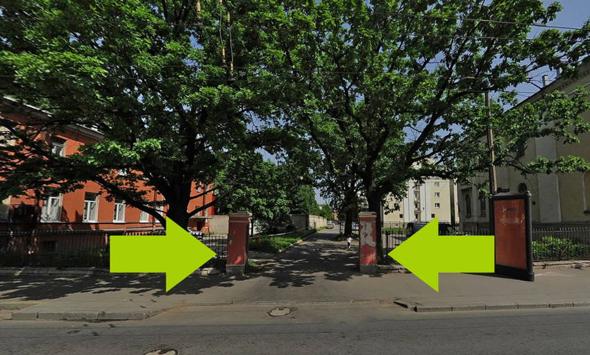

## Расписание

- **18:30** Вход
- **19:00** Открытие
- **19:10** Баги в браузерах: кто виноват и что делать? Виталий Зюзин
- **19:40** Перерыв
- **19:50** Архитектура дизайн-систем, Антон Виноградов
- **20:20** Перерыв
- **20:30** Синтаксис в редакторах кода, Александр Золотов и Денис Ушаков
- **21:00** Закрытие

## Доклады

### Баги в браузерах: кто виноват и что делать?

Бывает, когда один браузер показывает сайт не так, как остальные. Что это, баг браузера? Или все остальные браузеры ошибаются, а этот прав? Как понять, есть ли в вашем браузере баг, как помочь разработчикам браузера его отловить и исправить, а пока этого счастливого события не произошло, как попытаться обойти ошибку.

_Виталий Зюзин, [HTML Academy](http://htmlacademy.ru/)_

### Архитектура дизайн-систем

О проектировании дизайн-систем от разработчика интерфейсов. Что такое композиции компонентов и с чего стоит начинать строить свою систему, чем плохи и хороши имеющиеся на рынке решения и почему их точно нельзя использовать. Все то как передать бренд через интерфейсы в CSS с параноидальным переиспользованием кода. Дизайнерские и разработческие сетки, высокоуровневое проектирование интерфейсов с ориентацией на решение задач. Верстка и дизайн уровня «бог». Живые примеры, годы работы, инсайды, вот это вот всё.

_Антон Виноградов, [Protein](http://theprotein.io/)_

### Синтаксис в редакторах кода

Редакторы кода не просто открывают и сохраняют текстовые файлы, они ещё умеют помогать работать со множеством языков и технологий: подсветка, линтинг, анализ, подсказки и другое. Что делают редакторы у вас за спиной, чтобы сделать вашу жизнь проще — доклад от разработчиков IDE JetBrains и секция вопросов и ответов.

_Александр Золотов и Денис Ушаков, [JetBrains](http://jetbrains.ru/)_

## Площадка

Встреча пройдёт [в офисе компании JetBrains](http://jetbrains.ru/company/offices/#city=spb) на Васильевском острове. Ближайшая станция метро «Спортивная», выход на набережную Макарова по травалатору. Станция «Василеостровская» закрыта на ремонт. Также можно добраться из центра на 7 и 24 автобусах или 10 и 11 троллейбусах. Вход находится на перекрёстке Кадетской линии и Большого проспекта, после ворот пройдите 200 метров вглубь двора до офисного здания справа по пути.
