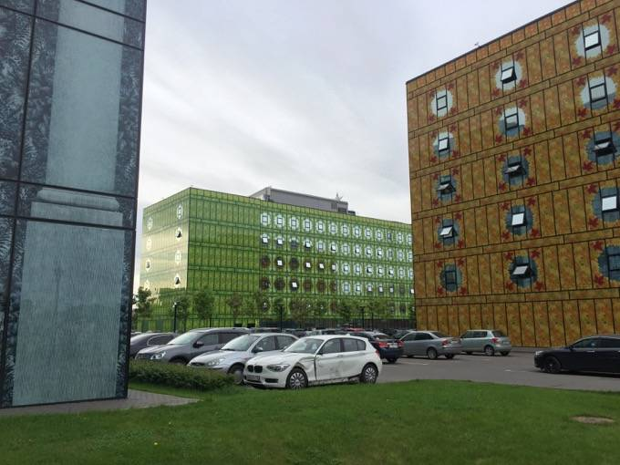
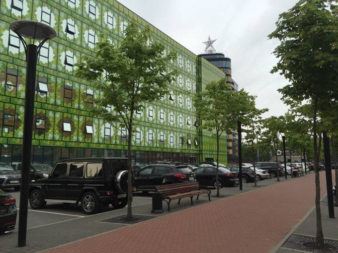
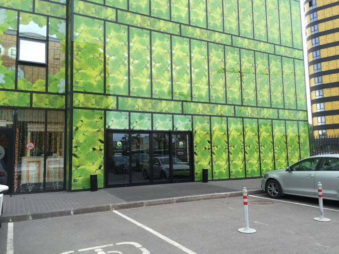
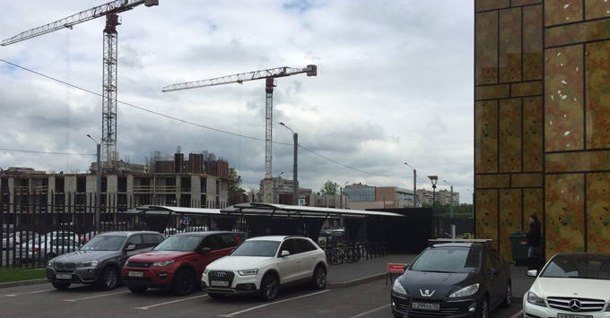
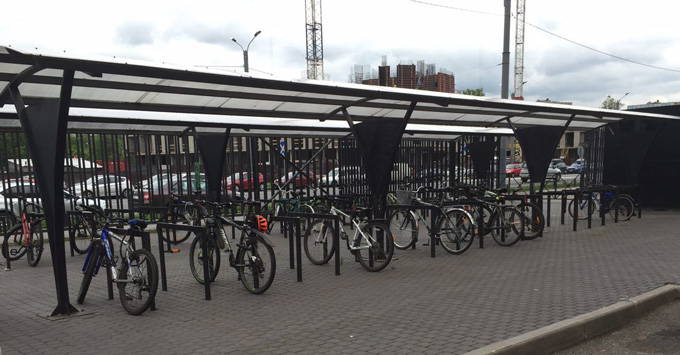

## Расписание

- **18:30** Вход
- **19:00** Открытие
- **19:10** Переходим на SVG, Дмитрий Рычков
- **19:40** Перерыв
- **19:50** Google AMP. Придаем ускорение мобильному вебу мощным пинком, Александр Приходько
- **20:20** Перерыв
- **20:30** Письмо другу. Небольшие хитрости, Антон Калашников
- **21:30** Закрытие

## Доклады

### Переходим на SVG

Зачем переводить проект на SVG: преимущества перед растровыми форматами, как начать использовать, как правильно приготовить к вёрстке. Обзор способов подключения и оптимизации SVG.

_Дмитрий Рычков, [Wrike](https://www.wrike.com/ru/)_

### Google AMP — придаем ускорение мобильному вебу мощным пинком

Мобильный веб ворвался в повседневную жизнь, сложно уже представить приличный сайт, который не дружелюбен к мобильным. В разработке мобильной версии требуется уделять внимание клиентской оптимизации и часто тяжело обходиться без компромиссов. Об этом можно говорить бесконечно и даже ничуть не нудно, но что же предлагают нам крупные игроки рынка? Accelerated Mobile Pages — инициатива Google, призванная ускорить «карманный» веб, её принципы работы и устройство.

_Александр Приходько, [Murano Software](https://www.muranosoft.com/)_

### Письмо другу. Небольшие хитрости

С какими особенностями приходится сталкиваться при вёрстке эл. писем: ограничения и подводные камни для разметки, стилей, шрифтов и других ресурсов. И как с этим комфортно жить и работать.

_Антон Калашников, [Yota](http://www.yota.ru/)_

## Площадка

Встреча пройдёт в офисе компании [Wrike](https://www.wrike.com/ru/) на 4 этаже в БЦ «Лето» (зелёное здание) на Свердловской набережной, 44Д. До площадки можно добраться:

- **Пешеходам:** метро «Площадь Ленина», выход к Финляндскому вокзалу. Слева от памятница Ленину, ближе к набережной, бесплатный автобус с надписью «Теорема» или «Пять звезд», ходит каждые 10-15 минут.
- **Велосипедистам:** рядом с БЦ «Осень» (жёлтое здание) есть велопарковка, см. фото ниже.
- **Автомобилистам:** на парковку можно въехать со Свердловской набережной либо с улицы Жукова. Первый час бесплатный, далее — 100 руб/час.

От остановки автобуса до БЦ «Лето» 3 минуты пешком через парк с белочками. На выходе из парка вы увидите три здания, вам в зелёное:

