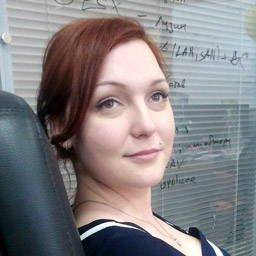
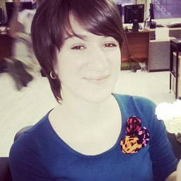
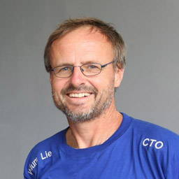

## Расписание

- **18:30** Вход
- **19:00** Открытие
- **19:10** Профи < Новичок, Алёна Батицкая
- **19:30** Перерыв
- **19:40** Отзывчивые картинки правильно, Зарема Халилова
- **20:00** Перерыв
- **20:30** Зачем изобрели CSS, Хокон Виум Ли
- **21:30** Закрытие

## Доклады

### Профи < Новичок

Делаем ставку на новичков в разработке.

_Алёна Батицкая, фронтендер и наставник из [Нетологии](http://netology.ru/)_

### Отзывчивые картинки правильно

Сколько весит ваша главная страница? Главная TJournal — 5,5 МБ, а VC.ru — 7,9 МБ. 80% этого трафика — изображения, которые загружаются и на смартфоны с маленьким экраном и мобильным интернетом. Изображения сжирают деньги и время ваших пользователей, а вы теряете их самих. Как сделать изображения, чтобы они экономили трафик, быстро загружались и подстраивались под экраны? Нет, указать ширину в 100% для  недостаточно.

_Зарема Халилова, фронтенд-разработчик из [Uploadcare](https://uploadcare.com/)_

### Зачем изобрели CSS

Вернёмся к самым истокам! CSS впервые был предложен Хоконом больше 20 лет назад в 1994 году. Но зачем? Ответы от автора.

_Хокон Виум Ли, технический директор [Opera](http://www.opera.com/)_

## Площадка

Встреча пройдёт в офисе компании T-Systems на 4 этаже БЦ «Елизаветинский» на 13 линии В.О., 14.
