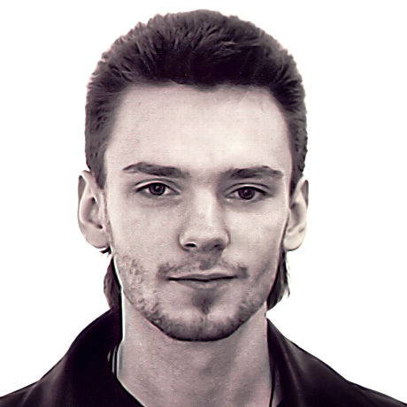
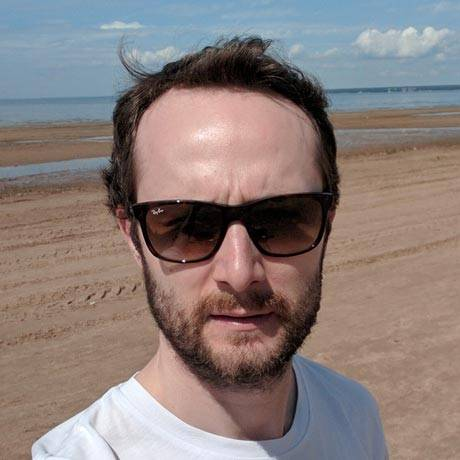
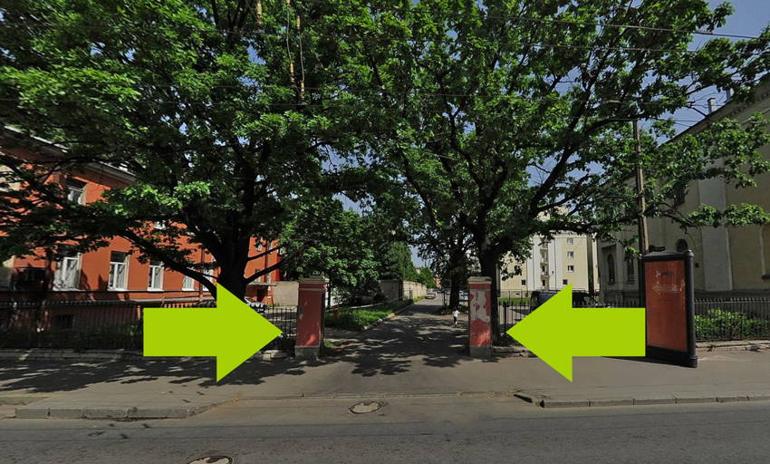

## Расписание

- **18:30** Вход
- **19:00** Открытие
- **19:10** Деревянный CSS, Андрей Волынкин
- **19:30** Перерыв
- **19:40** Webflow. Ноухау или конструктор? Александр Меньчик
- **20:00** Перерыв
- **20:30** Жми сюда! Вадим Макеев
- **21:30** Закрытие

## Доклады

### Деревянный CSS

Когда говорят о написании CSS, обычно рассматривают только описание компонентов. Но компоненты размещаются на страницах, которые тоже нужно как-то формировать. Какие есть возможности по описанию страниц, чтобы с масштабированием и разделением разработки? Методология, направленная на решение этих задач, с бо́льшим упором на деревья — от DOM и файловой системы до вложенности CSS.

_Андрей Волынкин, ведущий разработчик [M18](http://m18.ru/), преподаватель [ИТМО](http://ifmo.ru/)._

### Webflow. Ноухау во фронтенде или очередной конструктор?

Как мы открыли удивительный инструмент для вёрстки сайтов, с помощью которого мы облегчаем жизнь дизайнеров и разработчиков.

_Александр Меньчик, арт-директор и дизайнер в [1nsight](http://1nsight.ru/)._

### ​Жми сюда!

Все наши интерфейсы бесполезны без интерактивных элементов. Кнопки, ссылки, псевдоссылки — да какая разница? Див с онкликом и поехали. Как правильно выбрать, сверстать и не наделать глупостей. Куда делась мышка и кому вообще нужна навигация с клавиатуры.

_Вадим Макеев, веб-евангелист в [Opera](http://www.opera.com/)_

## Площадка

Встреча пройдёт [в офисе компании JetBrains](http://jetbrains.ru/company/offices/#city=spb) на Васильевском острове. Ближайшая станция метро «Спортивная», выход на набережную Макарова по травалатору. Станция «Василеостровская» закрыта на ремонт. Также можно добраться из центра на 7 и 24 автобусах или 10 и 11 троллейбусах. Вход находится на перекрёстке Кадетской линии и Большого проспекта, после ворот пройдите 200 метров вглубь двора до офисного здания справа по пути.
