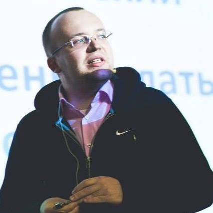
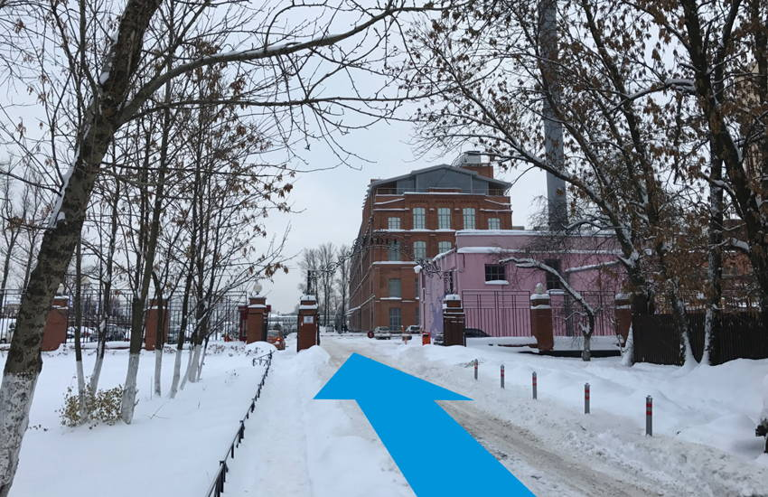
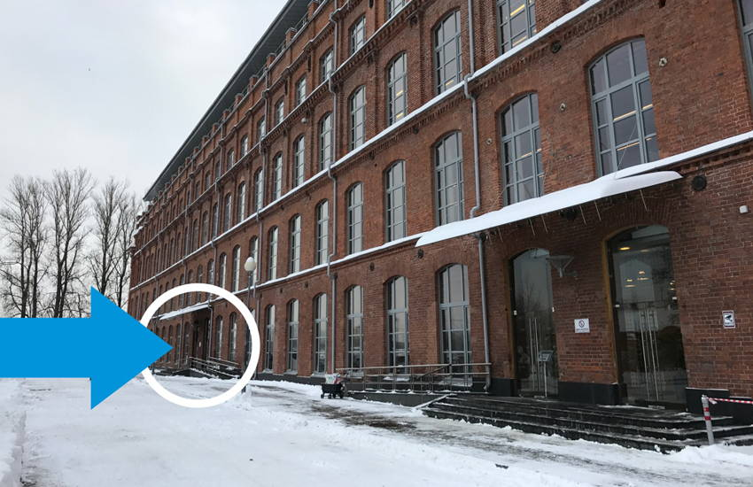

## Расписание

- **18:30** Вход
- **19:00** Открытие
- **19:10** Трудоустройство фронтендера, Андрей Гурылёв
- **19:30** Перерыв
- **19:40** Stylelint — как и зачем линтить CSS, Андрей Ситник
- **20:00** Перерыв
- **20:30** Техническая сторона типографики, Иван Гладких
- **21:30** Закрытие

## Доклады

### Трудоустройство фронтендера

Как фронтендеру правильно составить резюме, что написать в сопроводительном письме и о чём говорить на собеседовании.

_Андрей Гурылёв, Senior Frontend Developer в [Wrike](https://www.wrike.com/ru/), ментор в [NodeSchool SPB](https://nodeschool.io/spb/)_

### Stylelint — как и зачем линтить CSS

ESLint уже стал стандартом и большинство команд линтит JS. Но что с CSS? Какие есть линтеры для CSS и как линтер может повышать качество кода и решать социальные проблемы команды на примере Stylelint и Stylefmt.

_Андрей Ситник, фронтендер в [Злых марсианах](https://www.wrike.com/ru/), создатель [PostCSS](http://postcss.org/)._

### Техническая сторона типографики: настоящее и будущее

Часто разработчики экранных интерфейсов сталкиваются в своей работе со шрифтами. Современные тенденции дизайна/разработки требуют уделять много времени типографике. В данном докладе мы разберемся с текущим положением дел со шрифтами на рынке: кто разрабатывает шрифты, кто пользуется шрифтами. Разработчикам будет рассказано о современных инструментах для оптимизации шрифтов для веба и интерфейсов. Отдельной темой будет рассказано про нововведение в стандарте OpenType, представленное в 2016 году на конференции Atypi под названием Variable Fonts.

_Иван Гладких, основатель шрифтовой студии [TypeType](http://typetype.ru/) и образовательнго проекта [TypeTypeSchool](http://typetypeschool.ru/)._

## Площадка

Встреча пройдёт в офисе компании [Wargaming](http://wargaming.com/ru/) в БЦ «Фидель» на пр. Обуховской Обороны, 70 К3А. Ближайшие станции метро: пл. Александра Невского и Ломоносовская, Елизаровская закрыта на ремонт!

От «Ломоносовской»:

- На временном автобусе № 8 Б (ходит между «Ломоносовской» и «Елизаровской»). Остановка на нечётной стороне ул. Бабушкина либо на ул. Полярников.
- На временном автобусе № 8 В, остановка у станции «Ломоносовская» на чётной стороне ул. Бабушкина.
- На маршрутке № 365 (идёт по улице Бабушкина до «Елизаровской») и трамваями №7 и №24, идущими по пр. Обуховской Обороны.

От «Площади Александра Невского»:

- На автобусе № 8A, остановка на нечётной стороне Невского проспекта.

