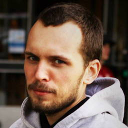
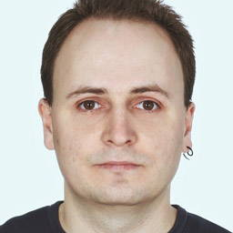
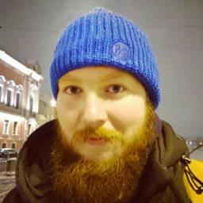
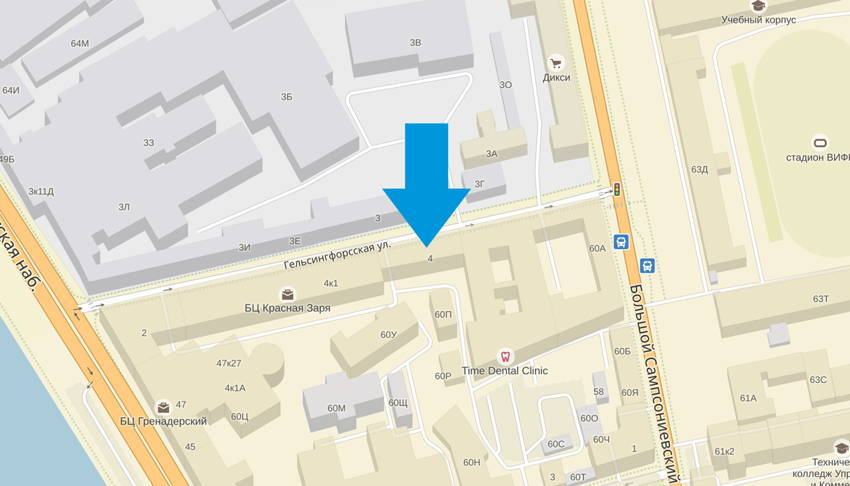
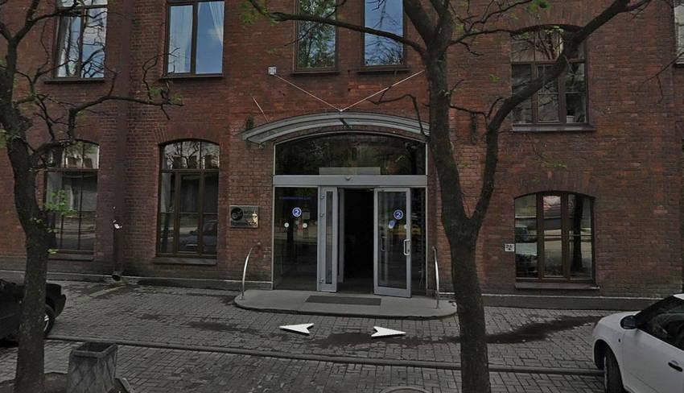

## Расписание

- **18:30** Вход
- **19:00** Открытие
- **19:10** Кастомные свойства в CSS, Алексей Хлебаев
- **19:30** Перерыв
- **19:40** Мой ванильный CSS, Вадим Макеев
- **20:00** Перерыв
- **20:30** Индивеб, микроформаты и веб-археология, Тим Маринин
- **21:30** Закрытие

## Доклады

### Кастомные свойства в CSS

Как CSS реализует возможности препроцессоров на примере Custom Properties.

_Алексей Хлебаев, веб-разработчик в [Яндекс.Деньгах](https://money.yandex.ru/)_

### Мой ванильный CSS

Пуризм, луддизм и общая усталость от хрупкой сахарной системы инструментов.

_Вадим Макеев, руководитель [Веб-стандартов](https://web-standards.ru/)_

### Индивеб, микроформаты и веб-археология

Будущее, которого не было.

_Тим Маринин, веб-разработчик в EPAM, ментор в [NodeSchool SPB](https://nodeschool.io/spb/)_

## Площадка

Встреча пройдёт [в офисе компании DataArt](http://dataart.ru/contacts/saint-petersburg/) в БЦ «Телеком СПб» на Большом Сампсониевском, 60А. Вход в БЦ с Гельсингфорсской улицы, 4 — в подъезд с табличной «Телеком СПб».  Ближайшие станции метро: Выборгская, Лесная, Петроградская.

