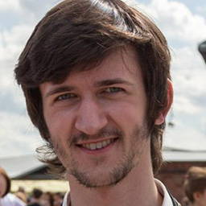
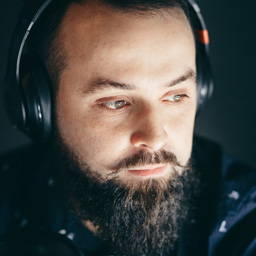
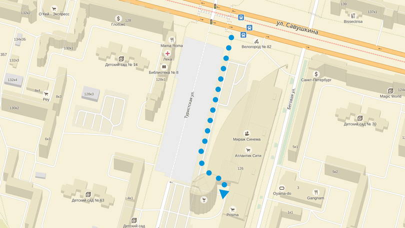
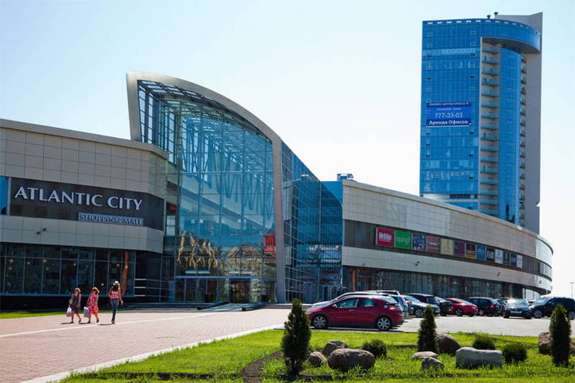
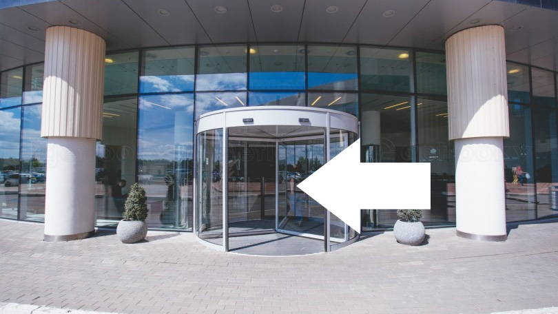
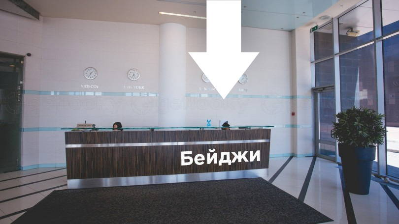
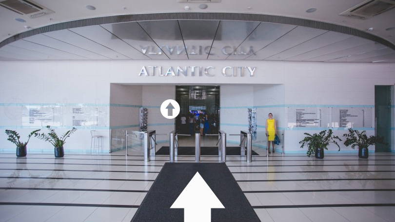

## Расписание

- **18:30** Вход
- **19:00** Открытие
- **19:10** Тестирование CSS, Антон Калашников
- **19:30** Перерыв
- **19:40** Гитхаб в Академии, Алексей Симоненко
- **20:00** Перерыв
- **20:10** Продуктивность, Милослав Волосков
- **20:30** Закрытие

## Доклады

### Тестирование CSS

А вы тестируете CSS? Нет? Тогда мы идём к вам!

_Антон Калашников, веб-разработчик в [Yota](http://www.yota.ru/)_

### Гитхаб в Академии — слайды

Как используют Гитхаб в HTML Academy, какие правила и приёмы помогают эффективно решать задачи. Кодят все!

_Алексей Симоненко, веб-евангелист в [HTML Academy](https://htmlacademy.ru/)_

### Продуктивность

Как правильно учиться и при этом чувствовать себя хорошо.

_Милослав Волосков, веб-разработчик_

## Площадка

Встреча пройдёт в офисе компании Yota в БЦ «Атлантик Сити» на Савушкина, 126. Ближайшие станции метро: Старая Деревня, Чёрная речка.

- **Старая Деревня:** автобусы №101 и №93, трамвай №19 и маршрутки №308 и №232.
- **Чёрная речка:** маршрутки №405, №206, №417, №210 и №690, автобус №211 и трамвай №48.

На входе в БЦ «Атлантик Сити» нужно получить именной пропуск, обязательно возьмите с собой паспорт.

Затем, на лифтах с левой стороны подняться на 14 этаж.

